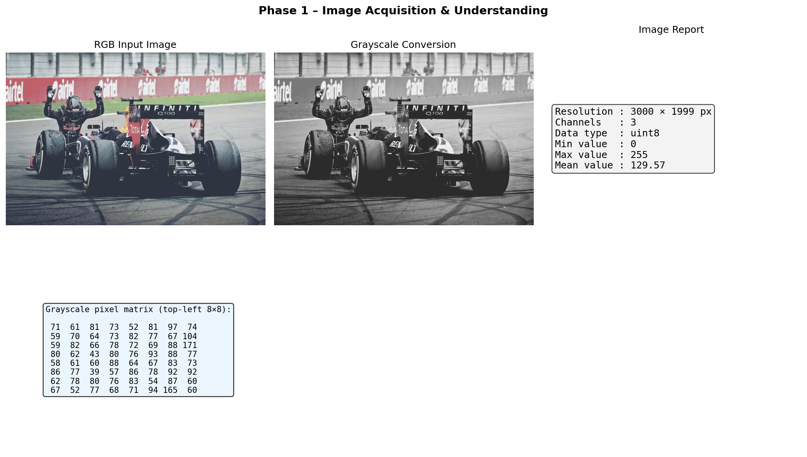
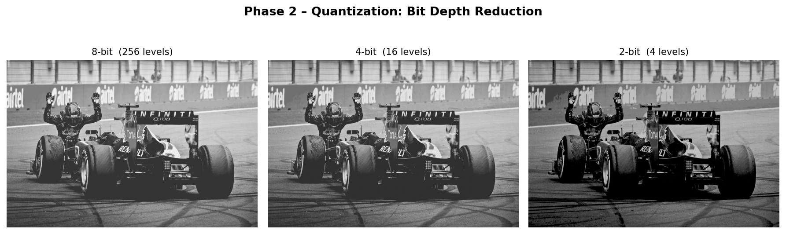
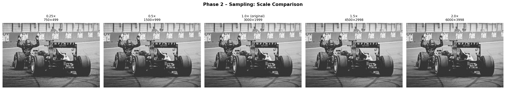
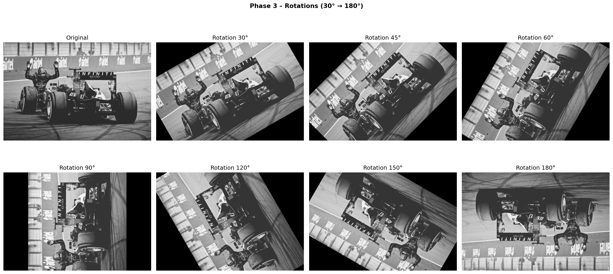
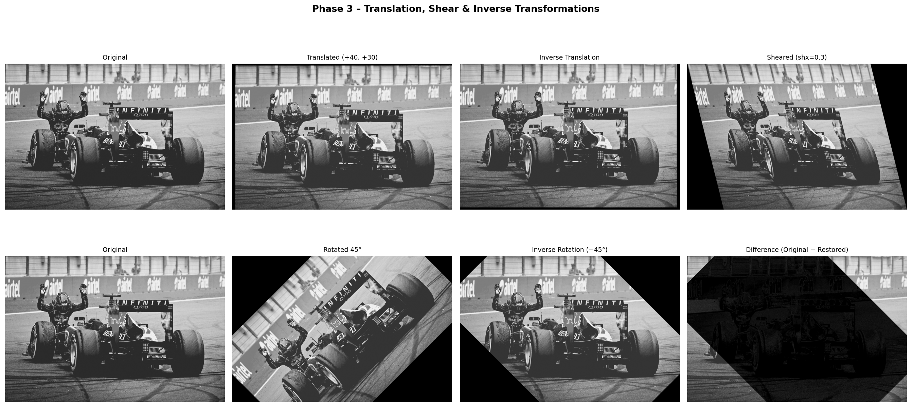
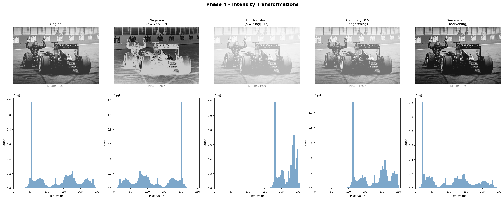
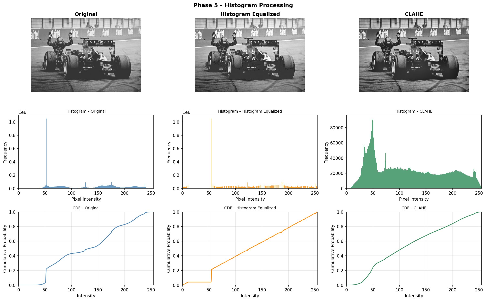
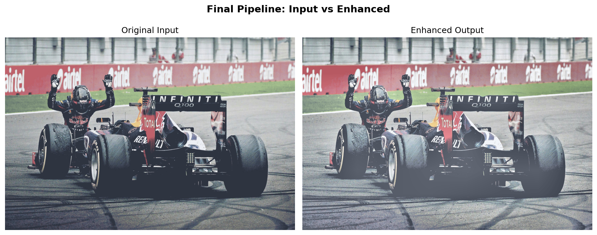

# DIP Image Enhancement System
### Lab 06 – Digital Image Processing | Mr. Ghulam Ali

Instructor: Sir. Ghulam Ali

A complete **Smart Image Enhancement & Analysis System** built in Python (OpenCV + Matplotlib), implementing a full six-phase image processing pipeline.

---

## Project Structure

```
DIP-Image-Enhancement-System/
├── code/
│   ├── main.py                        ← Entry point (run this)
│   └── functions/
│       ├── phase1_acquisition.py      ← Lab 01: Image basics
│       ├── phase2_sampling.py         ← Lab 02: Sampling & quantization
│       ├── phase3_geometric.py        ← Lab 03: Geometric transforms
│       ├── phase4_intensity.py        ← Lab 04: Intensity transforms
│       ├── phase5_histogram.py        ← Lab 05: Histogram processing
│       └── phase6_pipeline.py         ← Lab 06: Final integrated pipeline
├── images/
│   ├── input/                         ← Place your input image here (sample.png)
│   └── output/                        ← Enhanced output image saved here
├── results/                           ← All phase result figures saved here
├── README.md
└── report.pdf
```

---

## Setup & Run

```bash
# 1. Install dependencies
pip install opencv-python matplotlib numpy

# 2. (Optional) Place your own image at:
#    images/input/sample.png
#    If absent, a synthetic test image is auto-generated.

# 3. Run the full pipeline
python code/main.py
```

---

## Pipeline Phases

| Phase | Module | Description |
|-------|--------|-------------|
| 6.1 | `phase1_acquisition` | Load RGB/grayscale, display matrix, resolution, dtype |
| 6.2 | `phase2_sampling` | Up/down sampling (0.25×–2×), bit-depth reduction |
| 6.3 | `phase3_geometric` | Rotation, translation, shearing + inverse transforms |
| 6.4 | `phase4_intensity` | Negative, log, gamma (γ=0.5 & γ=1.5) |
| 6.5 | `phase5_histogram` | Histogram analysis, equalization, CLAHE |
| 6.6 | `phase6_pipeline` | `process_image()` — full integrated enhancement |

---

## Final Pipeline (process_image)

```python
from functions.phase6_pipeline import process_image
import cv2

img = cv2.imread("images/input/sample.png")
enhanced = process_image(img)
cv2.imwrite("images/output/enhanced_output.png", enhanced)
```

**Enhancement steps applied in order:**
1. CLAHE — local contrast enhancement
2. Gamma correction (γ=0.85) — mild brightening
3. Log transform blend (α=0.25) — shadow detail recovery
4. Unsharp masking — edge sharpening

---

  ## Results

### Phase 1 - Acquisition


### Phase 2 - Quantization


### Phase 2 - Sampling


### Phase 3 - Rotations


### Phase 3 - Transforms


### Phase 4 - Intensity


### Phase 5 - Histogram


### Final Comparison



---

## Technologies

- **Python 3.x**
- **OpenCV** — Image I/O, geometric transforms, histogram equalization, CLAHE
- **NumPy** — Array operations, gamma/log math
- **Matplotlib** — All visualization figures
